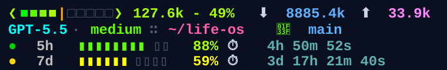

# codex-statusline

A colourful, information-dense 4-line status area for [Codex CLI](https://openai.com/codex), built with bash and tmux.

Codex does not currently expose the same native `statusLine` hook that Claude Code does, so this repo provides a small tmux wrapper. The wrapper launches Codex inside tmux and keeps a persistent 4-line status area at the bottom of the terminal.

## Preview



```text
❮■■■|□□□□□□□❯ 86.5k - 33%  ⬇️ 2507.9k ⬆️ 19.9k
GPT-5.5 · medium ∷ ~/project  🌿 main
🟡 5h ▮▮▮▮▮▮▯▯▯▯ 69% ⏱️    0h 19m 50s
🟡 7d ▮▮▮▮▮▮▯▯▯▯ 67% ⏱️ 3d 17h 51m 14s
```

**Line 1 — Context window**
- 10-cell gradient bar (green → yellow → orange → red) with `■`/`□` squares
- `❮`/`❯` brackets colour-matched to the percentage urgency
- Approximate context tokens in use and percentage: `86.5k - 33%`
- Token counts: ⬇️ input / ⬆️ output
- 100k marker (`|`) in the bar, useful as an early context-quality warning

**Line 2 — Session info**
- Active Codex model and reasoning effort, separated from location by `∷`
- Current working directory, truncated to the last 2 components
- 🌿 Git branch with status: `✎N` dirty files · `↑N` ahead · `↓N` behind

**Line 3 — 5-hour rate limit**
- Shown as **remaining** capacity (starts full, drains to empty)
- Emoji health dot: 🟢 > 75% · 🟡 > 50% · 🟠 > 25% · 🔴 > 0% · ⭕ empty
- `▮`/`▯` bar drains green → red as allowance is consumed
- Inline reset countdown with seconds (⏱️ `Nh Nm Ns`)

**Line 4 — 7-day rate limit**
- Same format as line 3, always on its own line for easy scanning
- Reset countdown includes full detail: `Nd Nh Nm Ns`

---

## Requirements

- **Codex CLI**
- `bash`
- `tmux` — used to keep the status area visible while the terminal scrolls
- `jq` — for parsing Codex session JSONL
- `git` — for branch and status info
- macOS-style `stat -f` for latest-session discovery

Install dependencies if needed:

```bash
# macOS
brew install tmux jq

# Ubuntu/Debian
sudo apt install tmux jq
```

---

## Install

**1. Download the scripts**

```bash
mkdir -p ~/.codex

curl -o ~/.codex/codex-statusline.sh \
  https://raw.githubusercontent.com/rgomes87/codex-statusline/main/codex-statusline.sh

curl -o ~/.codex/codex-with-status.sh \
  https://raw.githubusercontent.com/rgomes87/codex-statusline/main/codex-with-status.sh
```

**2. Make them executable**

```bash
chmod +x ~/.codex/codex-statusline.sh ~/.codex/codex-with-status.sh
```

**3. Launch Codex through the wrapper**

```bash
~/.codex/codex-with-status.sh
```

Optional shell alias:

```bash
alias codex-status='~/.codex/codex-with-status.sh'
```

**4. Restart the wrapped session** — the status area appears at the bottom of the terminal.

---

## Customisation

**Colours** — The script emits tmux style segments using 256-colour names such as `colour82`. Change any `c256 82` style call to a different colour number.

**Context bar width** — Change `BAR_WIDTH=10` in `codex-statusline.sh`.

**Refresh interval** — Change `status-interval 2` in `codex-with-status.sh`.

**Session name** — Change `SESSION_NAME="codex-status"` in `codex-with-status.sh`.

**Disable wrapping temporarily** — Set:

```bash
CODEX_STATUS_DISABLE=1 codex
```

---

## How it works

Codex writes session events under `~/.codex/sessions` as JSONL. `codex-statusline.sh` reads the latest session file, extracts the most recent token-count and turn-context events, then prints tmux-formatted status rows.

`codex-with-status.sh` launches Codex inside tmux, configures tmux with `status 4`, and maps each row to:

```text
status-format[0] → codex-statusline.sh --line 1
status-format[1] → codex-statusline.sh --line 2
status-format[2] → codex-statusline.sh --line 3
status-format[3] → codex-statusline.sh --line 4
```

The renderer is read-only. It does not write session data, modify Codex files, or start background processes beyond the tmux session used by the wrapper.

---

## Notes

- This is a Codex/tmux package, not a Claude Code statusline.
- It does not include or modify Claude files.
- Rate-limit values depend on the fields present in Codex session events.
- The scripts intentionally avoid hardcoded user paths and use `$HOME`.

---

## Claude Code statusline (`statusline.sh`)

A separate ANSI bash statusline for [Claude Code](https://claude.ai/code), using the native `statusLine.command` hook. Add to `~/.claude/settings.json`:

```json
"statusLine": {
  "type": "command",
  "command": "bash /path/to/statusline.sh"
}
```

### Preview

```
✓ Edit ×3  ✓ Read ×2
❮■■■■■|□□□□□❯ 106k - 53%  ⚡38%  🗜 1
Claude Sonnet 4.6 · high ∷ ~/project  🌿 main ✎2
🟢 5h ▮▮▮▮▮▮▮▮▯▯ 83% ⏱️ 4h 40m @ 03:28
🟡 7d ▮▮▮▮▮▮▯▯▯▯ 60% ⏱️ 1d 22h 50m @ 21:38 Thu
📖 read 131k · ✍️ wrote 1k · 🎯 hit 99% · 🗒 327 · 24h 59m
```

---

### Line-by-line guide

#### Line 1 — Active tools
Shows what Claude is doing right now and what it just did. Updates live as tools run.

```
✓ Edit ×3  ◐ Bash  ✓ Read
```

| Element | Meaning |
|---------|---------|
| `◐ ToolName` | Tool currently executing — shown in amber. Disappears once done. |
| `✓ ToolName` | Tool completed recently — shown in green. Up to 5 most recent. |
| `×N` | Tool was called N times in the recent batch. |
| **Name colours** | Blue = file ops (Read/Write/Edit) · Orange = Bash · Cyan = web · Purple = Agent/Task/Plan · Magenta = MCP |

This line is absent when no tools have run yet in the session.

---

#### Line 2 — Context window
Shows how much of the 200k context window is in use, plus two critical thresholds.

```
❮■■■■■|□□□□□❯ 106k - 53%  ⚡38%  🗜 1
```

| Element | Meaning |
|---------|---------|
| `❮■■░░❯` | 10-cell bar — filled cells show context used. Colour gradient: green (empty) → yellow → orange → red (full). |
| `\|` | 100k token marker inside the bar. Turns amber once you've passed it — a useful quality warning, since context beyond 100k gets harder for the model to reason over. |
| `106k - 53%` | Approximate tokens currently in the context window and the percentage of the 200k limit used. |
| `⚡38%` | **Headroom before autocompact fires.** Claude Code is configured to auto-compact at 91% — this shows how many percentage points remain. Green when comfortable, yellow below 25%, red below 10%. Goes to `⚡now` when at or past threshold. |
| `🗜 N` | **Times context was compacted this session** (gold). Each compaction summarises earlier conversation to free up space. Higher numbers mean a long or tool-heavy session. Hidden when 0. |

---

#### Line 3 — Model, effort & location
Identifies the active model configuration and where you're working.

```
Claude Sonnet 4.6 · high ∷ ~/project  🌿 main ⊕2 ✎1 ↑3
```

| Element | Meaning |
|---------|---------|
| Model name | Active Claude model — orange for Sonnet, green for Haiku, red for Opus. |
| `· effort` | Current `/effort` level — yellow (low) · green (medium) · periwinkle (high) · purple (xhigh) · rainbow (max). |
| `∷` | Separator between session config and filesystem location. |
| `~/project` | Working directory, truncated to the last 2 path components. |
| `🌿 branch` | Active git branch. Absent when the directory has no git repo. |
| `⊕N` | N staged files ready to commit (green). |
| `✎N` | N unstaged changes not yet staged (orange). |
| `↑N` | N commits ahead of the remote — unpushed work. |
| `↓N` | N commits behind the remote — incoming changes not yet pulled. |

---

#### Line 4 — 5-hour rate limit
Shows how much of your 5-hour usage allowance remains, and when it resets.

```
🟢 5h ▮▮▮▮▮▮▮▮▯▯ 83% ⏱️ 4h 40m @ 03:28
```

| Element | Meaning |
|---------|---------|
| 🟢🟡🟠🔴⭕ | Traffic light for remaining capacity: >75% · >50% · >25% · >0% · exhausted. |
| `▮▯` bar | 10-cell inverted bar — **starts full and drains** as you consume allowance. Colour shifts green → red as capacity falls. |
| `N%` | Percentage of the 5-hour window still remaining. |
| `⏱️ Xh Ym` | Countdown until the window resets. Shows seconds when under 1 hour. |
| `@ HH:MM` | Wall-clock time of the reset in your local timezone. |

---

#### Line 5 — 7-day rate limit
Same format as line 4 but for the rolling 7-day allowance, which resets less frequently.

```
🟡 7d ▮▮▮▮▮▮▯▯▯▯ 60% ⏱️ 1d 22h 50m @ 21:38 Thu
```

The reset label is relative: shows **today**, **tomorrow**, or an abbreviated weekday (Mon–Sun) for resets further out.

---

#### Line 6 — Prompt cache & session stats
Summarises how efficiently the session is using the prompt cache, and how long it has been running.

```
📖 read 131k · ✍️ wrote 1k · 🎯 hit 99% · 🗒 346 · 25h 6m
```

| Element | Meaning |
|---------|---------|
| `📖 read N` | Tokens **served from cache** this session (green). Cache reads are ~90% cheaper than fresh input — high values mean Claude is efficiently reusing prior context. |
| `✍️ wrote N` | Tokens **written into cache** this session (blue). New cache entries created as context grows. |
| `🎯 hit N%` | **Cache hit rate** — the proportion of input tokens that came from cache rather than being reprocessed. Green ≥80% · yellow ≥50% · red <50%. A high hit rate means the session is economical and fast. |
| `🗒 N` | **Number of assistant turns** in this session, parsed from the transcript. Gives a sense of session depth. |
| _duration_ | **Session age** — time elapsed since the first message in the current transcript (e.g. `25h 6m`). |

---

## License

MIT
